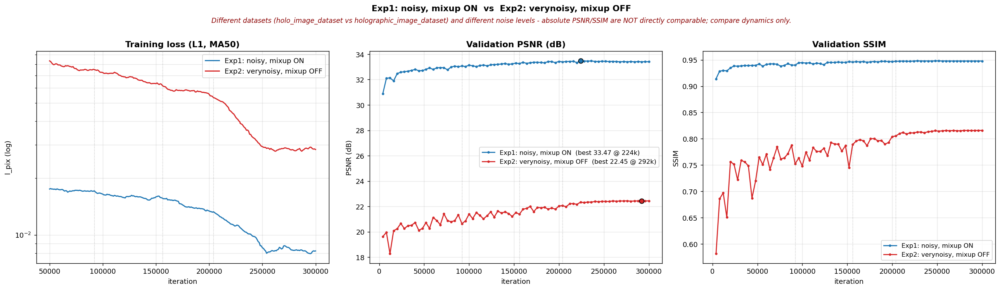

# Holo / Holographic Denoising — Experiment Results Log

Running log of every training experiment. Each entry records the **context**
(dataset, inputs, key hyperparameters, hardware), the **exact commands** used to
train and evaluate, and the **results**. Newest experiments at the top.

Metric conventions:
- **Val PSNR/SSIM** — full-image, computed on the validation set during training
  (basicsr `Validation ValSet` log lines).
- **Test full** — full-image PSNR/SSIM on the locked test set.
- **Test masked** — PSNR/SSIM restricted to the foreground object mask
  (`masked_metrics.py`), which better reflects object-region reconstruction than
  the full frame (large background lowers the denominator).

---

## Summary — Exp 1 vs Exp 2



| | Exp 1 (noisy, mixup ON) | Exp 2 (verynoisy, mixup OFF) |
|---|---|---|
| Dataset | `holo_image_dataset` | `holographic_image_dataset` |
| Best val PSNR | 33.473 @ 224k | 22.446 @ 292k |
| Final val PSNR / SSIM | 33.405 / 0.9478 | 22.437 / 0.8158 |
| Final train loss | ~9e-3 | ~2.8e-2 |
| Converged by | **~25k iters** | ~250–300k iters |
| Overfitting | slight post-peak decline after 224k | none |

> ⚠️ **The absolute PSNR/SSIM gap is NOT a fair comparison.** Three variables
> changed at once: dataset, input noise level, and mixup. Only the *dynamics*
> are meaningfully comparable. Any thesis claim of the form "verynoisy costs
> N dB" needs a controlled run (same dataset, same mixup setting, noise as the
> only variable).

**The useful finding is convergence shape, not the gap.** Exp 1 reaches ~32.5 dB
within ~25k iters and the remaining 275k buy only ~0.9 dB — its 300k budget was
largely wasted. Exp 2 improves steadily across the whole schedule and needs the
full budget. That is consistent with verynoisy being a genuinely harder task
rather than merely a shifted one.

Regenerate with:
```bash
python plot_compare.py \
  --exp_a Holo_Baseline_Restormer           --label_a 'Exp1: noisy, mixup ON' \
  --exp_b Holo_Baseline_Restormer_verynoisy --label_b 'Exp2: verynoisy, mixup OFF' \
  --out ../Deraining_Holo/experiment_results/compare_noisy_vs_verynoisy.png
```

---

## Exp 2 — Baseline Restormer, VERYNOISY input  🔄 RUNNING

**Status:** ✅ **complete** — full 300,000 iters, finished 2026-07-21 14:00.

**Context**
- Dataset: `holographic_image_dataset/` (6778 pairs; split 6101 train / 677 val)
- GT (target): `train_clean` / `val_clean`
- LQ (input): `train_verynoisy` / `val_verynoisy`  ← *verynoisy*, not noisy
- Experiment name: `Holo_Baseline_Restormer_verynoisy` (separate dir; does **not**
  touch Exp 1)
- Key change vs Exp 1: **mixup disabled** (`mixing_augs.mixup: false`)
- Config: `Options/Holo_Baseline_Restormer.yml`
- Model: Restormer, `inp_channels=1`, `out_channels=1` (grayscale uint16 /65535)
- Total iters: 300000 · loss: L1Loss · effective batch 8 (1 GPU)
- Hardware: 1× V100

**Commands**
```bash
# from repo root: /home/woody/iwnt/iwnt174h/thesis_dino/code/Restormer
# self-chaining resume driver (submit once; re-queues itself until 300k)
sbatch Deraining_Holo/train_holo_chain_verynoisy.sh
```
Outputs → `experiments/Holo_Baseline_Restormer_verynoisy/`
TensorBoard → `tb_logger/Holo_Baseline_Restormer_verynoisy`

**Run log**
- Submitted 2026-07-18 as job `1752760`; chain ran 3 jobs (`1752760`, `1752761`,
  `1753869`) under the cap of 5, each auto-resuming from the previous checkpoint.
- Final job wrote `TRAINING_DONE` and cancelled its own successor. Queue clean.
- Throughput ~0.81 s/iter · **16 h 47 m** total compute · 394 epochs
- GPU: V100-PCIE-32GB, 97 % utilization, 29.4 GB peak memory

**Results — FINAL (300k)**

| Metric | Value |
|---|---|
| **Val PSNR / SSIM (best)** | **22.446 / 0.8156** @ iter 292k |
| Val PSNR / SSIM (final) | 22.437 / 0.8158 @ iter 300k |
| Final train loss `l_pix` | ~1.5e-2 – 2.6e-2 |
| Test full PSNR / SSIM | _pending — see "Test evaluation" below_ |
| Test masked PSNR / SSIM | _pending_ |

Figures: `experiment_results/exp2_verynoisy/training_curves.png`,
`overfit_check.png`; comparison vs Exp 1 in
`experiment_results/compare_noisy_vs_verynoisy.png`.

**Observations**
- **Converged.** Last 8 evals sit in a 22.41–22.45 band and LR has annealed to
  1.0e-6. Best (292k) vs final (300k) differ by 0.009 dB — noise. Use
  `net_g_300000.pth`; cherry-picking 292k buys nothing and SSIM is marginally
  better at 300k.
- **No overfitting** (`overfit_check.png`): train loss keeps falling while val
  PSNR rises then plateaus, with no sustained decline after the peak. Contrast
  with Exp 1, which showed a slight post-peak decline after 224k.
- The 21.0–22.0 plateau seen at the 174k checkpoint **did resolve** — the run
  gained ~0.9 dB after the cosine LR restart at 208k. The heavy eval-to-eval
  oscillation before ~200k is LR-driven, not instability; it damps out as LR
  anneals.
- The full 300k budget was **used productively here**, unlike Exp 1 which was
  essentially converged by ~25k (see comparison section).

**Test evaluation — ⚠️ no held-out test set exists for this dataset**

`holographic_image_dataset/splits/` contains only `train.txt` and `val.txt`;
there are no `test_*` directories. Exp 1 had a locked `test_clean`/`test_noisy`
split, Exp 2 does not. So the command below evaluates on the **validation** set,
which was used for monitoring during training — it is *not* a clean held-out
estimate and must be labelled as validation in the thesis.

```bash
# from Deraining_Holo/ , with the venv python
PY=/home/woody/iwnt/iwnt174h/thesis_dino/code/venv/bin/python
DS=/home/woody/iwnt/iwnt174h/thesis_dino/holographic_image_dataset

# 1) run the final checkpoint over the val set (writes raw/ + viz/ + PSNR/SSIM)
$PY test_holo.py \
  --input_dir  $DS/val_verynoisy \
  --gt_dir     $DS/val_clean \
  --weights    ../experiments/Holo_Baseline_Restormer_verynoisy/models/net_g_300000.pth \
  --result_dir ./results/Holo_verynoisy_val_300k/

# 2) masked (foreground-object) metrics
$PY masked_metrics.py \
  --pred_dir  ./results/Holo_verynoisy_val_300k/raw \
  --gt_dir    $DS/val_clean \
  --threshold 0.01 --dilate 3 \
  --csv       ./results/Holo_verynoisy_val_300k/masked_metrics_per_image.csv
```

To get a genuine held-out test number, carve a test split out of the current
677-image val set (e.g. 338 val / 339 test) and re-evaluate on the unseen half.
The 6101 training images cannot be reused for this — the model has seen them.

---

## Exp 1 — Baseline Restormer, NOISY input  ✅ done

**Context**
- Dataset: `holo_image_dataset/` (locked train/val/test splits)
- GT (target): `train_clean` / `val_clean`
- LQ (input): `train_noisy` / `val_noisy`
- Experiment name: `Holo_Baseline_Restormer`
- mixup: **enabled** (`mixup_beta: 1.2`, upstream deraining recipe, faithful baseline)
- Config: `Options/Holo_Baseline_Restormer.yml` (as of commit d32ab74)
- Model: Restormer, `inp_channels=1`, `out_channels=1` (grayscale uint16 /65535)
- Loss: L1Loss · progressive patch schedule truncated at native 256px
- Hardware: 1× V100, effective batch 8 (upstream assumes 8 GPUs → batch 64)
- Best-val checkpoint selected: **iter 224000** (val PSNR plateaued; 300k not needed)

**Commands**
```bash
# Train (self-chaining resume driver)
sbatch Deraining_Holo/train_holo_chain.sh

# Evaluate best-val checkpoint (224k) on the LOCKED test set
python Deraining_Holo/test_holo.py \
  --input_dir  .../holo_image_dataset/test_noisy \
  --gt_dir     .../holo_image_dataset/test_clean \
  --weights    experiments/Holo_Baseline_Restormer/models/net_g_224000.pth \
  --result_dir Deraining_Holo/results/Holo_test_224k/

# Masked (foreground-object) metrics
python Deraining_Holo/masked_metrics.py \
  --pred_dir  Deraining_Holo/results/Holo_test_224k/raw \
  --gt_dir    .../holo_image_dataset/test_clean \
  --threshold 0.01 --dilate 3 \
  --csv       Deraining_Holo/results/Holo_test_224k/masked_metrics_per_image.csv
```

**Results** — test set, n=338 images

| Metric | Value |
|---|---|
| Val PSNR / SSIM (best, full-image) | **33.47** / **0.9479** |
| Val PSNR / SSIM (final @224k) | 33.40 / 0.9478 |
| Test full PSNR / SSIM | **33.50** / **0.9458** |
| Test masked PSNR / SSIM | **29.31** / **0.8739** |
| Mean mask fraction | 0.395 (range 0.14–0.80) |

Per-image data: `results/Holo_test_224k/masked_metrics_per_image.csv`
Figures: `results/Holo_test_224k/for_professor/` (training curves, typical &
blurry examples), `experiments/Holo_Baseline_Restormer/training_curves.png`

**Notes**
- Test set is the *noisy* variant of the old `holo_image_dataset`. Exp 2 switches
  to the newer `holographic_image_dataset` with the harder *verynoisy* input, so
  the two are **not directly comparable** — Exp 2 needs its own verynoisy test
  metrics before any cross-comparison.
