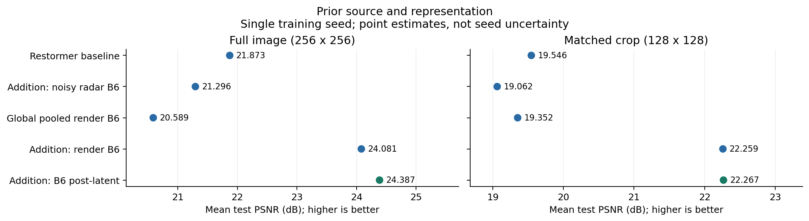
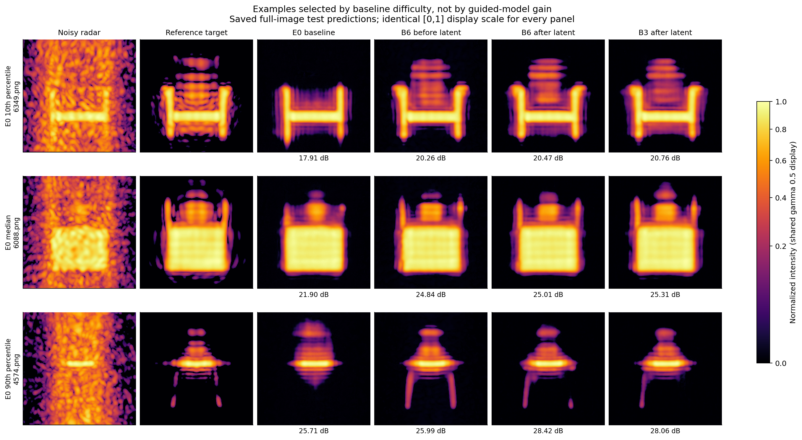
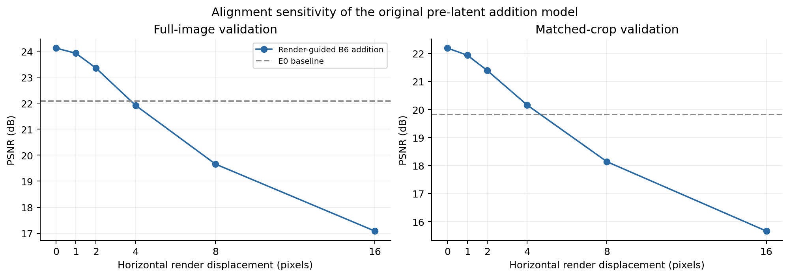
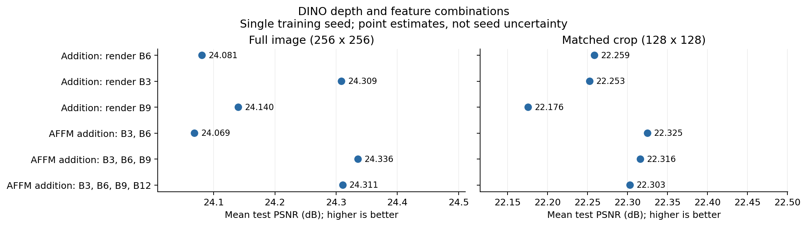
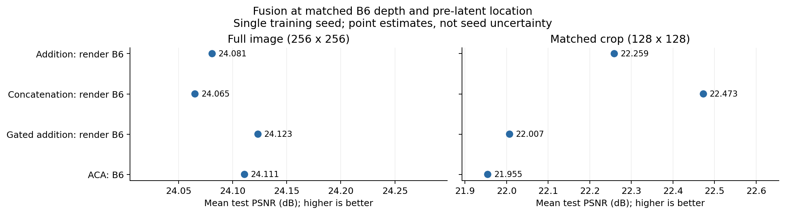
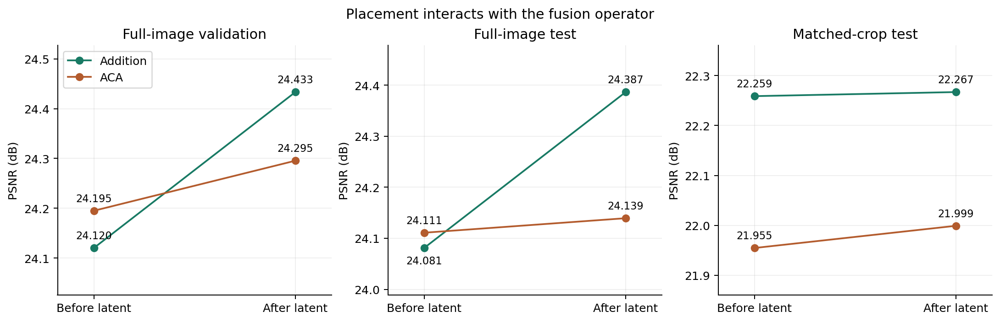
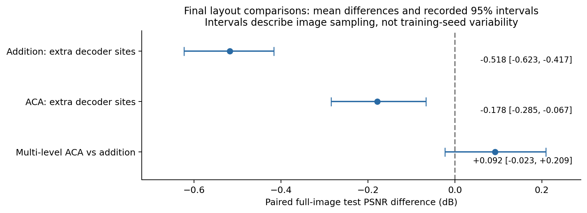
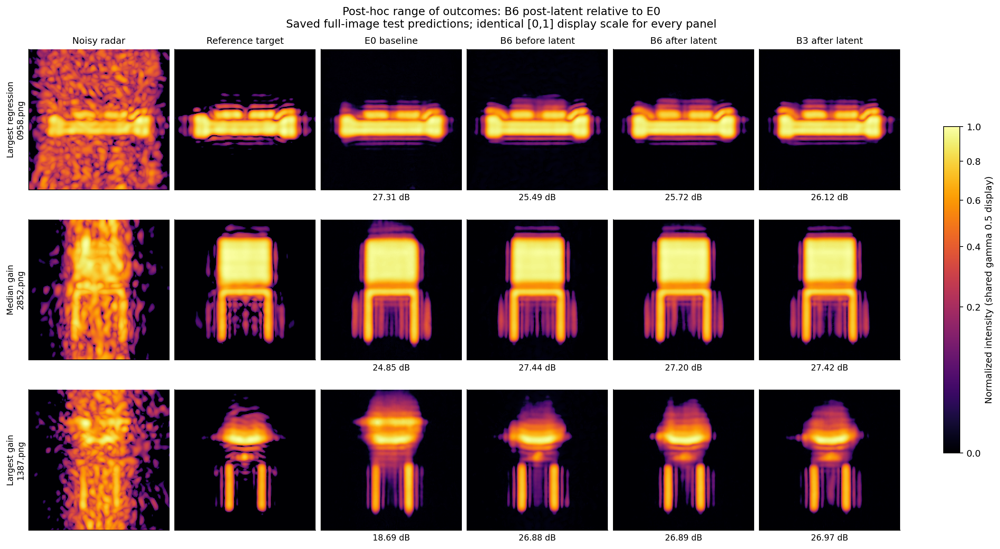
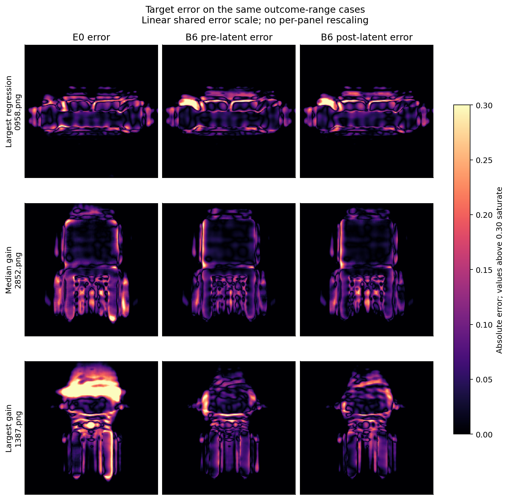
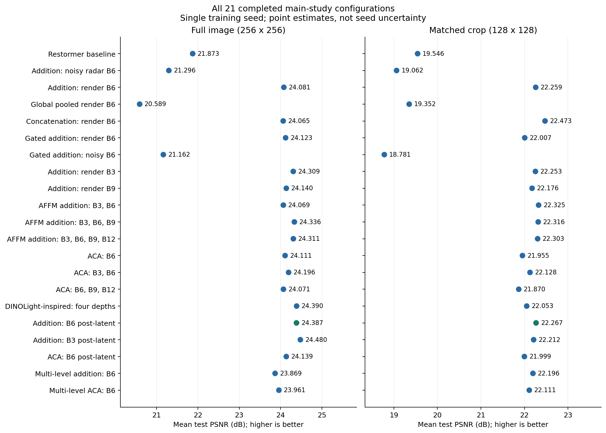

# Experimental results: spatial DINOv2 guidance for radar restoration

*Results chapter draft — 17 September 2026. Completed main-study experiments only. The two hobby refiner experiments are excluded. Tables and newly assembled figures use existing saved evaluations and predictions; no training or model inference was performed to produce this document.*

## Results at a glance

The study investigates when frozen DINOv2 features improve holographic radar restoration and how those features should be integrated into Restormer. The strongest result is that **spatial features from an aligned render substantially improve restoration**, while the same integration fed by noisy-radar features does not. A single additive injection after the latent blocks provides a strong final configuration. More complex fusion and repeated decoder injection do not consistently improve upon it.

The representative final model improves full-image test PSNR from **21.873 to 24.387 dB** and foreground PSNR from **17.599 to 19.891 dB**. B3 post-latent has the highest observed full-image test PSNR, **24.480 dB**, but is almost tied with B6 post-latent on validation. The evidence does not establish a unique optimum.

*Figure 1. Mean test PSNR for the baseline, alternative prior sources, global pooling, and the representative final configuration. The two panels score different evaluation regions and must be interpreted separately. The final configuration changes placement relative to the initial render-addition reference. Points are single-run means; they do not represent uncertainty across training seeds.*

*Figure 2. Saved full-image test predictions for cases at approximately the 10th, 50th and 90th percentiles of E0 baseline PSNR, in that order. Cases: {{TYPICAL_CASES}}. Examples are selected by baseline difficulty, not by the size of the guided model's improvement. All panels use the same intensity range [0,1] and gamma 0.5 for display. The PSNR labels come from the original evaluation CSVs and are not computed on the gamma-transformed display images. These examples are illustrations, not additional independent evidence.*

## 1. Evaluation setting and interpretation

The main task restores radar images generated with 10^5 rays using images generated with 10^7 rays as reference targets. The dataset contains 6,101 training images, 339 validation images and 338 test images. A render of the corresponding scene is available as an additional input for the render-guided configurations. The reference radar image is a supervision and evaluation target, not an inference input.

The 21 completed main-study configurations use 300,000 training updates, a batch size of eight, fixed 128 × 128 training crops and an L1 reconstruction loss. Restormer is trained from scratch, while the DINOv2 feature extractor remains frozen. The common optimizer is AdamW with initial learning rate 3 × 10^-4, weight decay 10^-4 and the shared cyclic cosine schedule. Each configuration is trained with one random seed, 100.

Two protocols are reported. **Full-image evaluation** restores the complete 256 × 256 image. **Matched-crop evaluation** restores a fixed 128 × 128 crop from each image, using a shared crop manifest across models. The crop protocol matches the training input size but evaluates a different region from the full-image protocol. Absolute scores must therefore be compared within a protocol; a direct difference between full-image and crop PSNR is not an isolated measure of context sensitivity.

Checkpoint selection uses the highest logged validation PSNR for each arm. The same selected checkpoint is evaluated under both protocols. Selection uses the common 8-bit training-validation implementation, while the final tables use the common uint16 evaluation path. These metric conventions are documented separately and their numerical values are not mixed in a comparison.

Whole-image PSNR and SSIM describe overall reconstruction accuracy. Foreground PSNR is computed over the target-derived object mask. Foreground SSIM averages the SSIM map over that mask; its local neighborhoods can still include nearby background. The existing foreground definition starts from target intensity greater than 0.01. Foreground results are important because improvements in a large background region need not imply improvements on the object itself.

Unless explicitly labelled validation, all tables below report test results. PSNR is expressed in dB; higher PSNR and SSIM indicate better agreement with the reference. Reported confidence intervals concern paired differences across images, not variability across independently trained models.

## 2. Representation analysis motivates the candidate priors

Before the guided restoration experiments, DINOv2 representations were compared across noisy radar, reference radar and aligned renders. The analysis considered several network depths and measured corresponding spatial-feature similarity alongside different-scene controls.

At the training crop scale, B6 produced the highest centered correspondence between noisy and reference radar, with mean cosine similarity approximately 0.669. However, B3 produced the largest same-scene advantage over different-scene correspondence: approximately 0.197, compared with 0.145 for B6.

These measures answer different questions. Absolute correspondence describes similarity across noise conditions. The same-versus-different-scene difference indicates how much correspondence is specific to the scene rather than shared more generally. Neither quantity directly measures restoration accuracy.

B6 was used as the initial reference depth. The later B3 and B9 restoration experiments test whether this representation-space choice also gives the best downstream result. The corrected Phase-2 analysis is used; an earlier block-alignment result in the append-only log is superseded and should not be treated as an independent experiment.

## 3. Prior source changes the direction of the effect

The first controlled comparison uses the radar-only E0 baseline and two guided models. One extracts DINO features from the noisy radar; the other extracts them from the aligned render. Both guided models use centered spatial B6 features and the same zero-initialized additive projection before the latent blocks. They have identical adapter parameter counts and matched training settings.

{{SOURCE_TABLE}}

*Table 1. Prior-source and spatial-representation comparisons. The global-render row is the spatial ablation discussed in Section 4. All guided rows here use B6 and pre-latent injection.*

Render guidance increases full-image PSNR by **2.208 dB** and foreground PSNR by **2.074 dB** over E0. The crop improvement is **2.713 dB**. Improvements therefore occur on both protocols and extend to the foreground.

In contrast, the noisy-radar prior reduces full-image PSNR by **0.577 dB** and crop PSNR by **0.484 dB**. A frozen feature extractor is not automatically beneficial: its input source matters under the tested integration recipe.

The comparison supports the usefulness of aligned render-derived guidance in this system. It does not isolate the value of DINOv2 from the extra information supplied by the render, since no matched raw-render or alternative-encoder control is included.

## 4. Spatial organization and alignment are important

The global-render configuration averages the B6 feature grid into one vector and broadcasts it across the latent feature map. The render source and projection parameter count remain the same as for spatial addition.

Global pooling reaches **20.589 dB**, which is **1.284 dB below E0**, whereas spatial addition reaches 24.081 dB. Retaining spatial organization is therefore useful for this additive integration. The result applies to pooled B6 patch features and the tested broadcast projection; it does not establish that every global-conditioning design is ineffective.

A separate inference intervention shifts the render horizontally while leaving radar input and reference target unchanged. It uses the original B6 pre-latent additive model on validation.

| Horizontal shift | Full-image validation PSNR | Change from aligned input |
|---|---:|---:|
| 0 pixels | 24.120 | — |
| 1 pixel | 23.920 | −0.200 |
| 2 pixels | 23.355 | −0.765 |
| 4 pixels | 21.914 | −2.207 |
| 8 pixels | 19.659 | −4.461 |
| 16 pixels | 17.081 | −7.039 |

*Table 2. Alignment intervention on validation, not a separate retrained model.*

*Figure 3. Render-translation sensitivity under both protocols. Dashed lines show the corresponding E0 validation baseline. The experiment concerns the original pre-latent addition model; alignment robustness was not independently measured for every later configuration.*

A four-pixel shift removes the original model's advantage over E0, whose full-image validation PSNR is 22.077 dB. The intervention demonstrates reliance on correct alignment and identifies a practical limitation of the tested method. Rotation, scale changes and non-rigid misalignment are outside this experiment's scope. Wrong-scene, zero-render and mean-render interventions provide additional evidence of dependence on the prior but do not estimate the performance of a model trained without it.

## 5. DINO depth affects restoration, but more layers are not always better

The depth study compares individual DINO blocks with combinations of blocks. Spatial render guidance and additive injection before the latent stage are held fixed. AFFM combines the selected layers through a learned weighted sum at each spatial position; it does not pool the spatial grid.

{{DEPTH_TABLE}}

*Table 3. Single-depth and multi-depth additive configurations.*

*Figure 4. Depth choices evaluated under both protocols. Connecting these alternatives into a monotonic "more depth is better" trend would be misleading.*

B3 improves full-image PSNR over B6 by **0.228 dB**, with the same direction observed on validation. Thus, the depth with the highest absolute feature correspondence is not necessarily the best restoration depth.

The three-depth and four-depth AFFM configurations improve on B6 by 0.255 and 0.230 dB, respectively. However, B3 alone reaches a similar performance range. The results do not establish that three or more depths are necessary. The two-depth configuration does not improve full-image test PSNR, and adding B12 to the three-depth configuration gives no clear further benefit.

Learned AFFM weights describe how a particular mixture is used. They are not causal importance scores and should not be interpreted as a ranking of standalone layer quality. In particular, a large weight on B9 does not show that B9 is the strongest individual depth.

## 6. Fusion effects depend on the evaluation protocol

Addition is compared with concatenation, gated addition and ACA channel cross-attention. The following comparison holds B6, the render source and the pre-latent injection location fixed.

{{FUSION_TABLE}}

*Table 4. Operator comparison at matched prior depth and location.*

*Figure 5. Full-image and crop results for the four fusion operators. The crop advantage of concatenation and crop penalties of gating and ACA are retained rather than hidden by the full-image comparison.*

The full-image means remain close: concatenation differs from addition by −0.016 dB, gating by +0.042 dB and ACA by +0.030 dB. These results do not establish a full-image advantage for the more complex operators.

On crops, concatenation improves over addition by approximately **0.214 dB**. Gated addition and ACA instead reduce PSNR by approximately **0.252 and 0.304 dB**. The evidence therefore supports a protocol-dependent effect, not the general claim that fusion never matters.

Gating also fails to rescue the noisy-radar prior. Gated noisy guidance reaches 21.162 dB on full images, compared with 21.296 dB for ungated noisy addition and 21.873 dB for E0.

The ACA depth variants provide a wider comparison:

{{ACA_TABLE}}

*Table 5. ACA variants. The four-depth configuration is a DINOLight-inspired adaptation, not a complete reproduction of the published system. Not every ACA depth set has an identical additive counterpart.*

The four-depth adaptation improves over the original B6-addition reference, but changes both depth set and operator. Relative to four-depth AFFM addition, its test advantage is only about 0.079 dB and its validation score is lower. Its gain over the initial reference cannot therefore be attributed specifically to cross-attention.

ACA-B6 adds approximately 4% to the **total trainable parameters** relative to simple addition. The often-quoted factor of about 4.6 refers to **added adapter parameters**, not the size of the complete network. Frozen DINO parameters and extraction costs are additional in both guided systems.

## 7. Injection after the latent blocks benefits addition

The placement comparison moves guidance from before the eight latent blocks to immediately after them. For each operator, the prior depth, source, projection dimensions and parameter count remain unchanged.

{{PLACEMENT_TABLE}}

*Table 6. Matched B6 placement comparison. The labels "Addition: render B6" and "ACA: B6" denote pre-latent injection.*

*Figure 6. Placement affects addition more strongly than ACA. Each panel has its own PSNR scale; the relevant comparison is the change within that panel.*

Moving addition after the latent stage improves full-image test PSNR by **0.306 dB**, with a similar **0.313 dB** increase on validation. Crop performance changes little.

ACA responds differently: moving it after the latent stage produces only a 0.028 dB full-image test improvement. At the post-latent location, ACA is **0.247 dB below addition**. A placement that benefits one operator does not necessarily benefit another equally.

This supports post-latent addition as an effective configuration. It does not identify the mechanism or establish that guidance is useful exclusively inside the decoder.

## 8. Combining B3 and post-latent placement gives limited extra benefit

The combined B3 post-latent configuration tests whether the single-depth and placement gains accumulate.

{{STACKING_TABLE}}

*Table 7. Depth × placement comparison for addition. Validation is shown to make the final configuration choice transparent.*

B3 post-latent gives the highest observed full-image test score. Nevertheless, it exceeds B6 post-latent by only **0.094 dB** on test and approximately **0.002 dB** on validation. The paired mean-difference interval on test is approximately **[−0.004, +0.190] dB** and includes zero.

The experiment does not demonstrate a clear additional improvement over the stronger constituent under the registered criterion. The appropriate conclusion is that the improvements did not clearly combine under this training recipe. It is not evidence of a universal performance ceiling.

B6 post-latent is retained as the representative final configuration for continuity with the main comparisons. B3 post-latent remains a competitive alternative and is reported alongside it. B6 is not claimed to be uniquely optimal or statistically equivalent to B3.

## 9. Repeated decoder injection reduces full-image accuracy

The final pair compares a single post-latent injection with injection at three locations: post-latent, decoder level 3 and decoder level 2. Both operators reuse one B6 DINO extraction. The decoder sites receive nearest-neighbour-expanded feature grids through the documented mappings.

| Operator | Single post-latent site | Post-latent + decoder 3 + decoder 2 | Difference |
|---|---:|---:|---:|
| Addition | 24.387 | 23.869 | −0.518 |
| ACA | 24.139 | 23.961 | −0.178 |

*Table 8. Full-image test PSNR for the final operator × layout comparison.*

*Figure 7. Recorded paired mean differences and 95% intervals. The first two contrasts compare each multi-level configuration with its own single-site counterpart. The last contrast compares operators within the multi-level layout. Intervals quantify image variation and do not measure seed variability.*

Both operators lose full-image accuracy after the additional sites are introduced. The intervals are **[−0.623, −0.417] dB** for addition and **[−0.285, −0.067] dB** for ACA. ACA loses less, yielding an operator-by-layout interaction of approximately **+0.339 dB**. This interaction describes their different responses to the layout; it does not turn either multi-level configuration into an improvement.

The corresponding crop differences are −0.071 dB for addition and +0.112 dB for ACA, with mean-difference intervals that include zero. Thus, the full-image losses do not appear in the same form under matched-crop evaluation.

The tested single-site design is preferred. This result concerns reuse of the same B6 grid with the chosen mapping and training recipe. It does not identify which added site causes the loss or establish that every hierarchical design is ineffective.

## 10. Attention interventions distinguish dependence from advantage

Inference interventions on the trained ACA-B6 model examine the contribution of its cross branch and learned channel mixing.

| Validation condition | Full-image PSNR | Change |
|---|---:|---:|
| Unmodified trained model | 24.195 | — |
| Cross contribution removed | 17.679 | −6.516 |
| Cross-attention weights made uniform | 24.049 | −0.146 |

*Table 9. Inference interventions at the same selected ACA checkpoint, not separately trained ablations.*

Removing the cross contribution severely reduces performance, so the trained model does use the branch. Uniform mixing causes a smaller but measurable loss, showing that the learned mixing also affects its output.

These findings do not contradict the operator comparison. A model may depend on a component without outperforming another model trained with a simpler component. Removing the cross branch also changes the input distribution seen by downstream layers. The loss is therefore not an estimate of the gain the component provides over a separately trained baseline. The two PSNR drops must not be divided to produce a percentage contribution.

## 11. Crop context and attention failure analysis

The Phase-5 representation study finds that DINO features differ when a region is processed as an isolated crop instead of within the full image. Matching feature-grid dimensions does not eliminate this context dependence. B6 crop/full correspondence is approximately 0.708 for raw features in the validation analysis; a separate centered-token analysis gives correspondence around 0.55. Boundary regions show larger discrepancies.

These measurements establish a representation shift but do not fully explain restoration rankings. All guided models experience a context change, yet their responses differ.

The stopped spatial-token cross-attention experiment illustrates the most severe protocol dependence. Its late 178k checkpoint reaches **21.812 dB on validation crops**, compared with 19.816 dB for E0, but only **14.517 dB on full validation images**, compared with 22.077 dB for E0. Full-image validation selected an earlier 4k checkpoint, and the training run was stopped around 179k rather than completing 300k. This is a diagnostic failure case, not a clean comparison between fully trained fusion operators.

Additional completed studies are kept separate from architecture results. Non-overlapping crop-based inference produces approximately the same validation accuracy as direct full-image inference. Overlapping inference improves accuracy, but the controls associate most of the gain with combining overlapping predictions rather than simply matching the training crop size. A feature-space correction probe improves crop/full correspondence on held-out scenes, but was not integrated into restoration and supplies no restoration-PSNR result.

## 12. Final quantitative and qualitative comparison

The representative final model uses a frozen spatial B6 prior from the aligned render, projected through one zero-initialized 1 × 1 convolution and added after the latent blocks. The adapter adds **295,296 trainable parameters**, approximately **1.13%** over E0. This is a small trainable adapter, not a claim of negligible end-to-end computation: frozen DINO extraction remains necessary.

{{FINAL_TABLE}}

*Table 10. Final model alongside E0, the initial guided reference, and the competitive B3 alternative. Foreground SSIM is included to show that the highest full-image PSNR does not maximize every metric.*

Relative to E0, B6 post-latent gains **2.514 dB** in full-image PSNR, **2.291 dB** in foreground PSNR and **2.721 dB** in matched-crop PSNR. Full-image SSIM rises from 0.7829 to 0.8270; foreground SSIM rises from 0.5598 to 0.6372. In the saved per-image full-image test scores, **{{IMAGE_COUNTS}}**. These counts describe this checkpoint, not training-seed reproducibility.

The original render-addition model has higher foreground SSIM than B6 post-latent (0.6433 versus 0.6372), despite its lower full-image and foreground PSNR. Its high-frequency-energy ratio is also higher (0.328 versus 0.285). Both ratios exceed E0's 0.218 but remain below the reference level. Thus, the selected configuration improves reconstruction accuracy without maximizing every structural or sharpness measure. Higher PSNR does not demonstrate recovery of every missing object part.

*Figure 8. An explicitly post-hoc range of outcomes selected by the full-image test PSNR difference between B6 post-latent and E0: largest regression, median difference and largest improvement. Cases: {{EXTREME_CASES}}. These examples expose variation and failure rather than estimate average performance. They use the same intensity display convention as Figure 2.*

The examples help explain both the improvement and its limits. In Figure 2, image 6349 contains upper structures that are largely absent from the baseline output but visible in the guided predictions. However, their fine pattern remains smoother than the reference. In image 4574, guidance improves the overall arrangement of the reconstructed signal, while some thin lower structures remain incomplete. These cases support improved reconstruction of some structures, not complete recovery of every object part.

Figure 8 also shows why the average improvement should not be treated as a guarantee. In image 0958, the baseline scores 27.31 dB, whereas B6 post-latent scores 25.72 dB: the guided prediction changes the upper intensity pattern and does not better match the reference overall. At the other extreme, image 1387 improves from 18.69 to 26.89 dB, with a visibly better match to the reference's upper shape and less diffuse signal. Even this strong improvement leaves smooth details. The largest gain and loss were selected deliberately to illustrate the observed range; they are not representative estimates of expected performance.

*Figure 9. Absolute error against the reference target for the same three cases as Figure 8. All panels use one linear error scale from 0 to 0.30; larger errors saturate. The shared scale prevents independent contrast adjustment from making one method appear artificially better. The figures were assembled from existing predictions, without inference or modification of those predictions.*

## 13. Scope and limitations of the findings

Each training configuration uses one seed. Paired image-level intervals and agreement between validation and test support the observed comparisons but do not replace independent training repetitions. Non-significance is not evidence of equivalence.

Although checkpoint selection uses validation only, test results were inspected during the evolving study. Later experiments are exploratory follow-ups rather than a single untouched confirmatory evaluation. Image-filename splits also do not by themselves establish unseen-object or unseen-category generalization; those claims require separate dataset provenance.

The render is an additional inference input whose availability and alignment are required. The experiment suite does not determine whether DINOv2 is necessary relative to direct render conditioning or another encoder. The results therefore concern the evaluated render-guided system, not an isolated claim about semantic knowledge in DINO.

The pooled-global failure is scoped to the tested broadcast integration. The multi-level result is scoped to the tested reused-grid layout. The DINOLight-inspired arm is an adaptation rather than a complete published-method reproduction. No superiority over externally trained restoration architectures is claimed.

The historical progressive baseline is not used as the matched main baseline: it differs in crop schedule, and its test partition was carved from a previously used validation set. Early FiLM attempts, dropped prior-query attention and the zero-gradient ACA-without-self-attention smoke are recorded as failed or incomplete investigations rather than successful performance ablations. The two hobby refiners are outside this chapter.

Within the stated conditions, the study demonstrates a substantial benefit from aligned spatial render guidance and identifies single-site additive injection as an effective integration strategy. The accompanying negative results define the limits of that strategy and show why additional architectural complexity does not automatically improve restoration.

## Appendix A. Complete results for the completed main-study configurations

All 21 rows below completed the common training budget. Each has validation and test results under both protocols. The stopped spatial-token attention run is described separately in Section 11 and is not included as a completed configuration. Repeated rows across the main chapter are comparisons of the same trained models, not additional experiments.

{{ALL_TABLE}}

*Table A1. Full completed main-study inventory. All numbers are test results. Unless named post-latent or multi-level, guidance is injected before the latent blocks.*

*Figure A1. All completed configurations, ordered by experimental question rather than test rank. Green identifies the representative final configuration, not a statistically unique winner.*

### Mapping to repository experiment identities

| Chapter label | Experiment directory name |
|---|---|
{{PROVENANCE_TABLE}}

## Appendix B. Sources, reproducibility and figure exports

The document's tables are populated from saved `metrics/*_summary.json` files. All 21 full-image test CSVs were checked against the corresponding summary means for full-image/foreground PSNR and SSIM. The 84 summary cells were checked for expected sample counts, and the test image sets agree across configurations. These are report-consistency checks, not new model evaluations.

- [Complete numeric table (CSV)](complete_results.csv): all 21 configurations and all four evaluation cells, including checkpoint paths.
- [Source hashes and figure selection (JSON)](provenance.json): input SHA-256 hashes, sample-selection rules and selected image identifiers.
- [Figure directory](figures/): each new figure is supplied as PNG and PDF. PDFs are suitable for insertion in a thesis; no AI-generated images are used.
- [Readable HTML version](RESULTS.html): the same chapter with embedded local figures; open in a browser. Keep the `figures` directory alongside it.
- [Report assembler](build_report.py): reads saved JSON/CSV/PNG files only, imports no model code, and writes only inside this report directory. `RESULTS.template.md` is the prose source; `RESULTS.md` and HTML are the rendered documents.

Primary repository records:

- [Main-study specification](../dino_analysis_phases/phase3_restoration/README.md).
- [Development record](../DEVLOG.md), especially Steps 42–50 and 53; some earlier interpretations are superseded.
- [Final operator × layout comparison](../dino_analysis_phases/phase3_restoration/results/comparisons/final_matched_pair.json).
- [Depth × placement comparison](../dino_analysis_phases/phase3_restoration/results/comparisons/stacking_2x2.json).
- [ACA inference interventions](../dino_analysis_phases/phase3_restoration/results/aca_interventions/aca_interventions_val.json).
- [Alignment sweep](../dino_analysis_phases/phase3_restoration/results/render_misalignment/misalignment_summary.json).
- [Corrected Phase-2 summary](../dino_analysis_phases/phase2/outputs/dino_prior_source_summary.csv).
- [Training-scale depth recheck](../dino_analysis_phases/phase3_restoration/results/wo1_verification/wo1_layer_recheck_summary.csv).

**Editorial note.** This chapter deliberately does not repeat older claims that three depths are necessary, attention is unused, global guidance always fails, or ACA makes the entire network 4.6 times larger. The completed comparisons support narrower conclusions, as stated in the results above.
